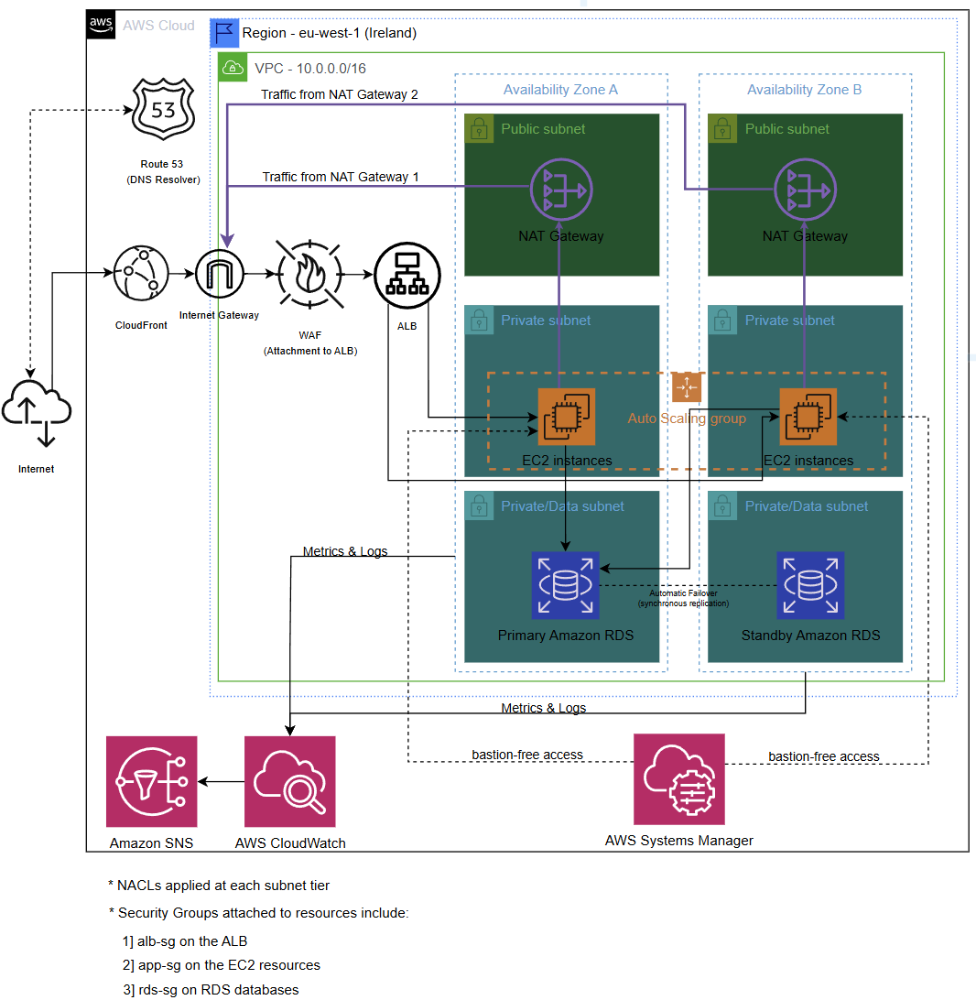

# Scalable Web Application on AWS

A production-grade, highly available web application deployed on AWS across two
Availability Zones. Traffic is served through Amazon CloudFront and an
Application Load Balancer; compute runs on Auto Scaling EC2 instances in private
subnets, and data is stored in a Multi-AZ Amazon RDS database. The design
targets high availability, elastic scalability, security, and cost efficiency.

## Architecture



### Inbound request flow

1. A user requests the application by its domain name, resolved by Amazon Route 53.
2. Route 53 routes to Amazon CloudFront, which serves cached static assets from
   edge locations and forwards dynamic requests toward the origin.
3. Traffic enters the VPC through the Internet Gateway and reaches the
   Application Load Balancer, where AWS WAF inspects it against OWASP Top 10 rules: e.g., injection and
   XSS.
4. The ALB distributes traffic across EC2 instances in an Auto Scaling group
   spread over two private subnets in two Availability Zones.
5. The instances read from and write to the Multi-AZ Amazon RDS primary in the
   isolated data subnet.
6. As for the secondary RDS database, automatic failover is applied in case the primary database is
   down by applying synchronous replication at all times.

### Outbound flow

Instances in the private subnets reach the internet for updates and patches
through a NAT Gateway in their Availability Zone, which forwards to the Internet
Gateway. Inbound (ALB/WAF) and outbound (NAT) are independent paths.

## AWS services

| Layer          | Service                    | Purpose                                              |
| -------------- | -------------------------- | ---------------------------------------------------- |
| DNS            | Amazon Route 53            | Domain resolution and health checks                  |
| Edge / CDN     | Amazon CloudFront          | Cache static assets, reduce latency and origin load  |
| Security       | AWS WAF                    | Filter malicious traffic (OWASP Top 10) at the ALB   |
| Load balancing | Application Load Balancer  | Layer-7 routing, health checks, traffic distribution |
| Compute        | EC2 + Auto Scaling         | Elastic web tier across two Availability Zones       |
| Database       | Amazon RDS (Multi-AZ)      | Managed relational database with automatic failover  |
| Networking     | VPC, subnets, IGW, NAT     | Network isolation and controlled routing             |
| Access         | AWS Systems Manager        | Bastion-free, auditable instance access              |
| Monitoring     | CloudWatch + SNS           | Dashboards, alarms, and notifications                |

## Design decisions and cost optimization

Each choice below notes why the service was selected and the main lever used to
keep it cost-efficient. Cost figures are approximate and for the eu-west-1
(Ireland) region:


| **VPC across 2 AZs** | Two Availability Zones deliver high availability as required in this project. Two AZs rather than three meet the HA requirement while reducing resource and cross-AZ data costs.

| **NAT Gateway** | Managed service, highly available outbound internet access for private instances—largest recurring cost (about $35/month each if kept running and no free tier). 

| **Application Load Balancer** | Layer-7 features path/host routing, health checks that a Network Load Balancer does not provide. Cost is calculated hourly + Load Balancer Capacity Unit (LCU) pricing (~$20-25/month baseline); A single shared ALB fronts the whole application.

| **EC2 + Auto Scaling (t3.micro)** | Burstable instances suitable for variable web workload; the group scales automatically using ASG. The Auto Scaling group launches instances from a Launch Template that defines the AMI, instance type, security group, and user-data bootstrap.
As for the instance family, the T3 family is utilized since it can perform the job well and there is no need for extra-intensive compute. Auto Scaling uses a target-tracking policy set to 60% average CPU utilization. When average CPU rises above the target, the group adds instances to maintain
performance; when it falls and stays below the target, the group removes instances to control cost. The target-tracking policy continuously adjusts capacity to keep utilization near 60%.

| **CloudFront** | Serves cached content from edge locations, cutting latency. Caching reduces origin requests and associated data transfer; CloudFront egress is cheaper than serving all content from EC2/ALB.

| **RDS Multi-AZ** | Automatic failover for the database, the hardest tier to make highly available manually. Multi-AZ roughly doubles database instance cost, justified for production compared to a dev variant that uses single-AZ, a smaller class, and gp3 storage.

| **AWS WAF** | Managed OWASP Top 10 protection without building a custom filtering layer. Managed rule groups avoid custom rule development; billed per rule and per request.

| **Systems Manager** | Removes the need for a bastion host for instance access. No bastion EC2 to run and pay for; Session Manager is free for this use.

| **CloudWatch + SNS** | Native metrics, logs, alarms, and alerting. Free-tier metrics and alarms cover a small footprint; low-volume SNS notifications are effectively free.

**General cost principles applied:** right-size with burstable instances, scale
on demand instead of over-provisioning, prefer gp3 over gp2 storage (due to performance-to-cost ratio is optimized), caching at the edge, isolate the data tier (no NAT route required)

## Security

- Compute and database run in private subnets; only the ALB is internet-facing.
- **Security groups** are least-privilege and tier-to-tier:
  - `alb-sg` on the ALB (HTTP/HTTPS from the internet)
  - `app-sg` on the EC2 instances (traffic from the ALB only; no SSH)
  - `rds-sg` on the database (traffic from the app tier only)
- **Network ACLs** are applied at each subnet tier for stateless, subnet-level control.
- The data tier has no route to the internet.
- No inbound SSH or RDP; access is through AWS Systems Manager Session Manager and is audited.
- Amazon RDS is encrypted at rest and is not publicly accessible.
- AWS WAF is implemented to mitigate the network-facing OWASP risks (notably injection and XSS) automatically and is maintained and updated by AWS, providing strong baseline protection without custom rule development.

## Monitoring

Amazon CloudWatch collects metrics and logs from the compute, load balancing,
and database tiers, drives Auto Scaling, and triggers alarms. Amazon SNS
delivers alarm notifications by email to the selected users.

## Repository structure

```
.
├── README.md
└── docs/
    └── architecture-diagram.png
```

## Deployment

Infrastructure-as-code deployment (AWS CloudFormation) is planned as a
follow-up. The template will provision the full stack — VPC, subnets, NAT, ALB,
WAF, Auto Scaling, Multi-AZ RDS, CloudWatch, and SNS — as a single stack that
can be created and deleted automatically.

## Author

Ahmed Amro — Cloud Engineer / Solutions Architect
